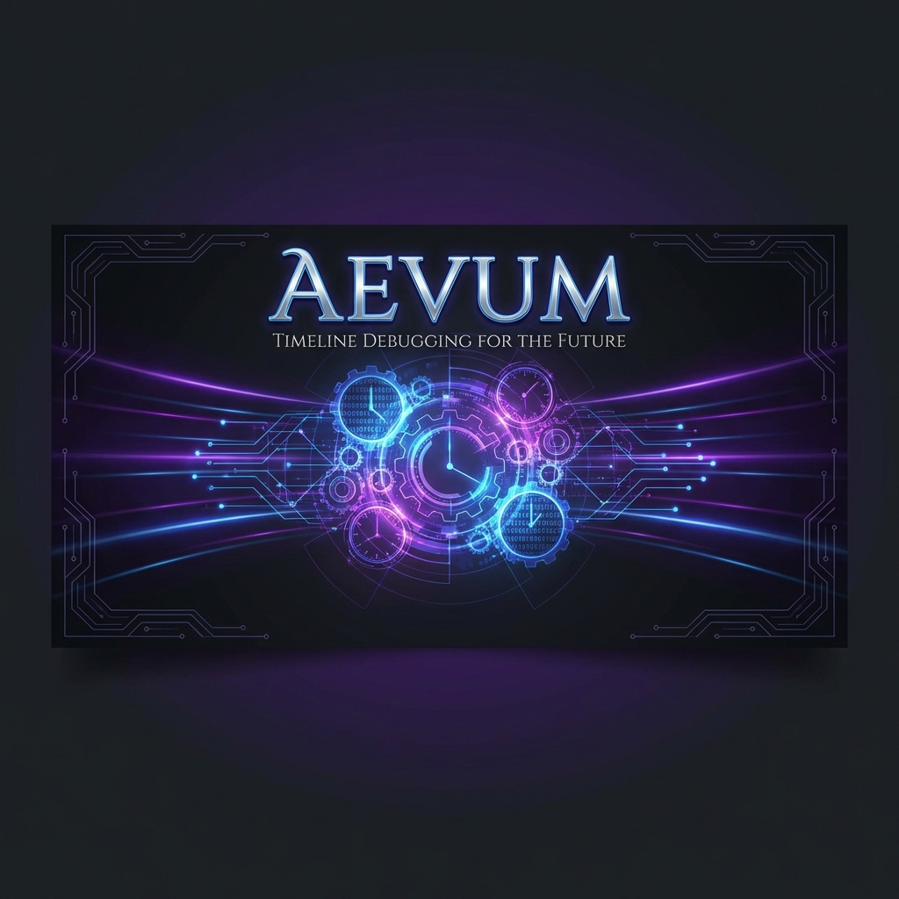
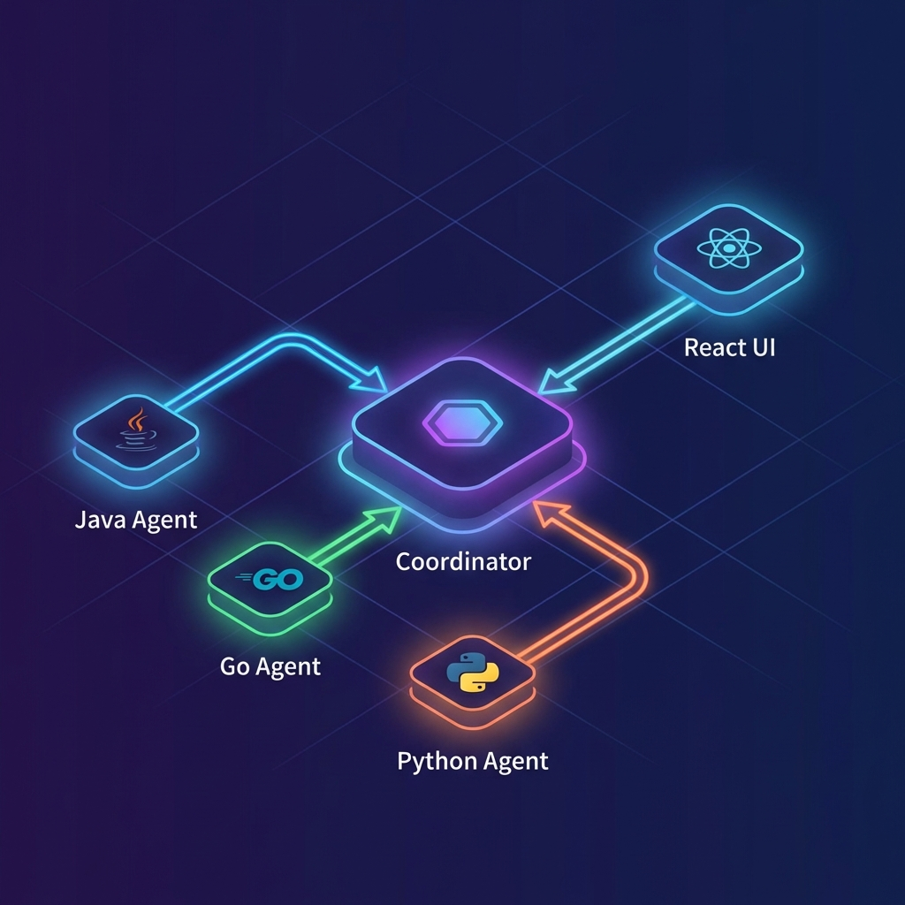
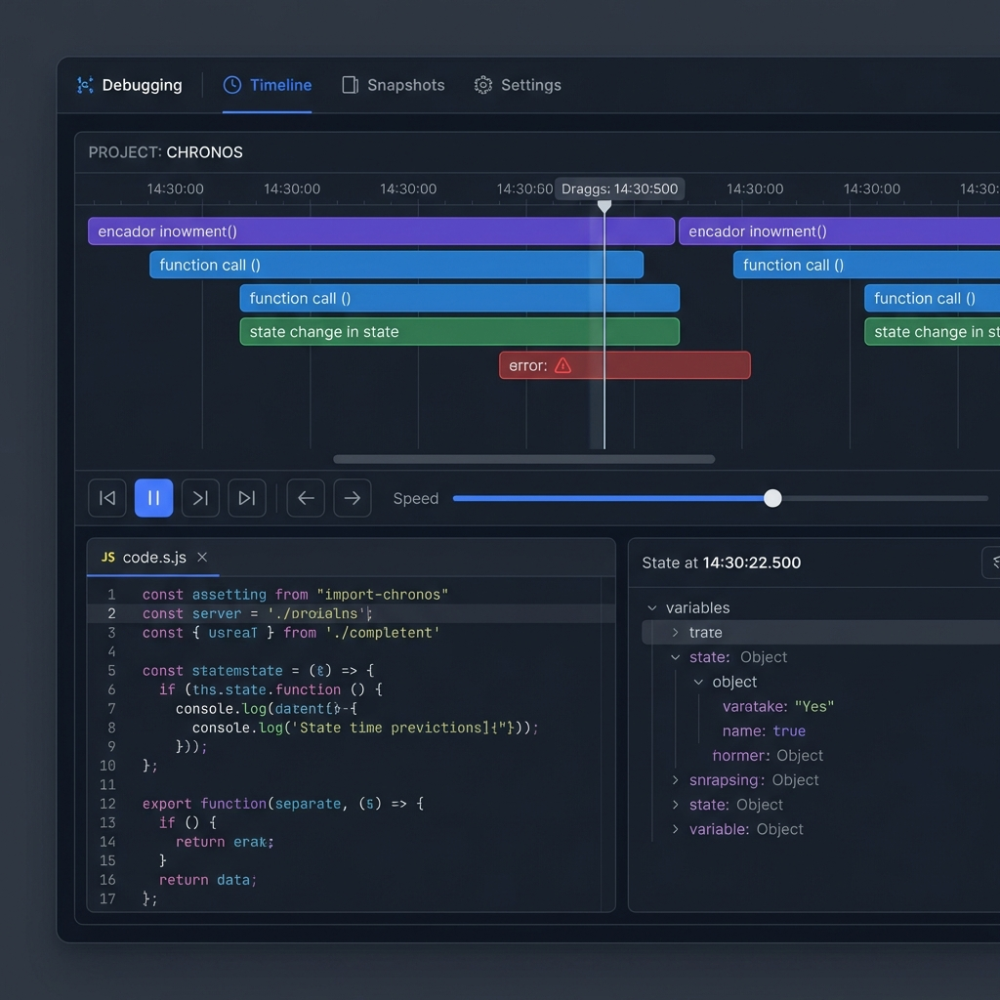
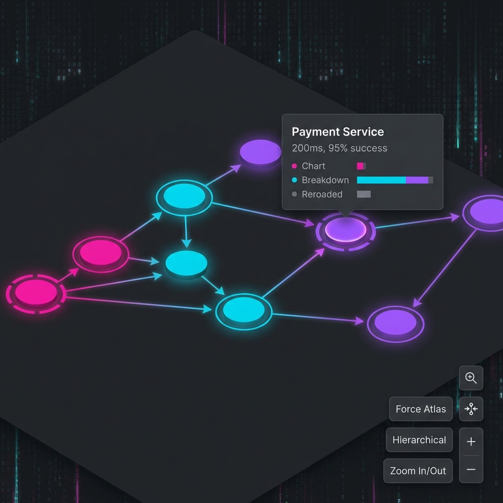

<div align="center">

# Aevum
**Time-Travel Debugging for Distributed Systems**

[](LICENSE)
[](https://golang.org/)
[](https://reactjs.org/)
[]()

[Features](#-key-features) • [Architecture](#-architecture) • [Getting Started](#-getting-started) • [Visual Tour](#-visual-tour) • [Documentation](#-documentation)

</div>

---

## 🔮 Overview

**Aevum** is a next-generation debugging platform designed to unravel the complexity of distributed systems. Unlike traditional debuggers that pause a single process, Aevum captures the **causal history** of events across microservices, threads, and asynchronous boundaries.

It allows you to **replay execution**, **inspect state specific to a moment in time**, and **visualize the "happens-before" relationships** that define your system's behavior.

## ✨ Key Features

- **⏱️ Time-Travel Execution**: Step forward and backward through the history of your system with millisecond precision.
- **🕸️ Causal Graphs**: Visualize distributed traces as a Directed Acyclic Graph (DAG) to understand dependencies.
- **🔍 Deep State Inspection**: View the exact state of variables, memory, and threads at any past timestamp.
- **⚡ Zero-Config Instrumentation**: Lightweight Java agent attaches to running processes without code changes.
- **🎨 Premium UI**: A beautiful, dark-themed dashboard optimized for complex data visualization.

---

## 🏗️ Architecture

Aevum follows a distributed architecture designed for scalability and minimal overhead.



1.  **Agents**: Lightweight probes (Java, Go, Python) run alongside your application, capturing events (function calls, network IO, state changes) and tagging them with vector clocks.
2.  **Coordinator**: A high-performance Go server that ingests event streams, resolves clock skew, and merges timelines into a global causal history.
3.  **UI**: A React-based visualizer that queries the coordinator to render timelines and graphs.

---

## 📁 Project Structure

```text
Aevum/
├── 📂 agents/              # Instrumentation agents
│   └── 📂 jvm-agent/       # Java Bytecode Instrumentation (ASM)
├── 📂 coordinator/         # Central backend server (Go)
│   ├── 📄 main.go          # Entry point and API server
│   └── 📄 api.go           # REST API implementation
├── 📂 ui/                  # Frontend Dashboard (React + Vite)
│   ├── 📂 src/
│   │   ├── 📂 components/  # Timeline, Graph, and State views
│   │   └── 📄 App.tsx      # Main application logic
│   └── 📄 package.json
├── 📄 docker-compose.yml   # Container orchestration
├── 📄 start-dev.ps1        # One-click development startup script
└── 📄 README.md            # This documentation
```

---

## 🚀 Getting Started

### Prerequisites
- **Go** 1.21+
- **Node.js** 18+
- **Java** 17+ (for agent usage)

### One-Click Startup (Windows)
We provide a unified script to launch the full stack:

```powershell
./start-dev.ps1
```

This will automatically:
1.  Start the **Coordinator** on `localhost:9876` (Agent Port) and `localhost:8080` (API Port).
2.  Start the **UI** on `localhost:5173`.

### Docker Deployment
For a consistent production environment:

```bash
docker-compose up --build
```

### Manual Setup
<details>
<summary>Click to expand manual steps</summary>

**1. Start Coordinator**
```bash
cd coordinator
go run main.go
```

**2. Start UI**
```bash
cd ui
npm install
npm run dev
```

**3. Attach Agent**
```bash
java -javaagent:agents/jvm-agent/target/aevum-agent.jar=trace-id=my-trace -jar app.jar
```
</details>

---

## 🎨 Visual Tour

### Timeline Debugger
Navigate through execution history with intuitive playback controls. The timeline highlights causality violations and critical path latency.



### Causal Dependency Graph
Understand how services interact with a crystal-clear DAG visualization. Click nodes to inspect payload data and network latency.



---

## 📚 Documentation

### API Reference
The Coordinator exposes a REST API for custom integrations:
- `GET /api/traces`: List all captured traces.
- `GET /api/timeline/{id}`: Get the fully merged event timeline.
- `GET /api/stats`: System health and volume metrics.

### Configuration
| Environment Variable | Description | Default |
|----------------------|-------------|---------|
| `PORT` | API Server Port | `8080` |
| `AGENT_PORT` | Agent Ingestion Port | `9876` |
| `LOG_LEVEL` | Logging verbosity | `info` |

---

## 🤝 Contributing
We welcome contributions! Please see [CONTRIBUTING.md](CONTRIBUTING.md) for details on how to submit pull requests, report issues, and request features.

## 📄 License
This project is licensed under the MIT License - see the [LICENSE](LICENSE) file for details.

---
<div align="center">
Built with ❤️ by the Aevum Team
</div>
